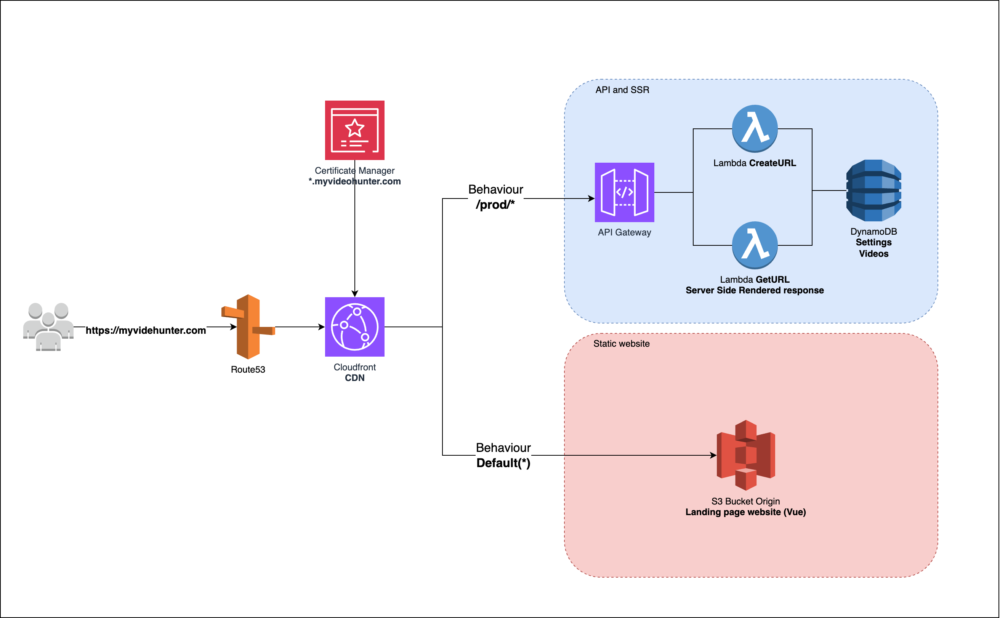

[](https://codecov.io/github/victoraldir/videohunter_api)

<!-- PROJECT LOGO -->
<br />
<p align="center">
  <a href="#">
    
  </a>

<h3 align="center">Your favorite video downloader</h3>

  <p align="center">
    A bunch of APIs, SSR, and bot's scripts for the Video Hunter website.
    <br />
    <a href="https://www.myvideohunter.com"><strong>Video Hunter Website</strong></a>
    <br />
    <br />
  </p>
</p>

## Summary

Video Hunter is a website that allows you to download videos from Twitter. It's a side project and I use it as a playground to learn new technologies and experiment thing, mainly around Serverless and Golang. 

Video Hunter **does not store any video on its servers**. It's just a proxy that allows you to download videos straight from Twitter's CDN.

## Architecture



Video Hunter is composed of 3 main components:

- **APIs**: In total, two operations. One to "create" a URL, which means transforming a Twitter URL into a "downloadable" URL, and another one to get the video itself. The get video operation is an SSR (Server Side Rendering) function, which means that the function will return an HTML page with the metadata embedded in it.

- **Static Website**: The website is a static website hosted on S3. It's a simple Vue.js that expects a URL as a parameter and then redirects the user to the SSR function.

- **Bot (TODO)**: The bot is a simple Python script that automates a telegram bot. The bot will receive a Twitter URL and then return the Video Hunter URL.

## Dependencies

- [Go](https://golang.org/)
- [SAM CLI](https://docs.aws.amazon.com/serverless-application-model/latest/developerguide/serverless-sam-cli-install.html)

## Running locally

Before running the project locally, make sure that the docker deamon is running. Then, run the following command:

```bash
make run-local
```

This command will spin up DynamoDB and the API Gateway locally. After that, you can run the following command to create a new URL:

```bash
# Create a new URL
curl -X POST http://localhost:3000/urls -d '{"url": "https://twitter.com/elonmusk/status/1392602041025846272"}'

# Get the URL
curl http://localhost:3000/urls/{id}
```

You can also go the URL http://localhost:8001/ to access the local DynamoDB console. From there, you can see the table and the items created.

## Testing

To run the tests, run the following command:

```bash
make test
```

## Deploying

Before deploying, make sure that you have the AWS CLI configured and credentials to deploy the application. Then, run the following command:

```bash
make deploy
```
